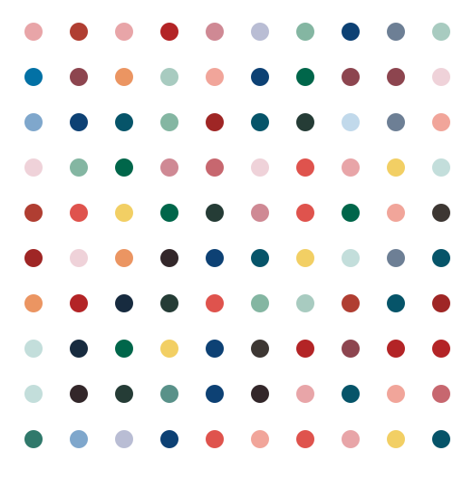

# Hirst Spot Painting with Turtle 🎨

This Python script creates a colorful painting using the Turtle graphics library. It extracts colors from an image and recreates it using randomly placed dots on the canvas.


## How to use 

   ```bash
# Draw the painting with the following parameters:
# - n: Number of dots horizontally
# - m: Number of dots vertically
# - path: Spacing between dots
# - dot_size: Size of each dot
draw_painting(10, 10, 50, 20)
   ```

## Example output

